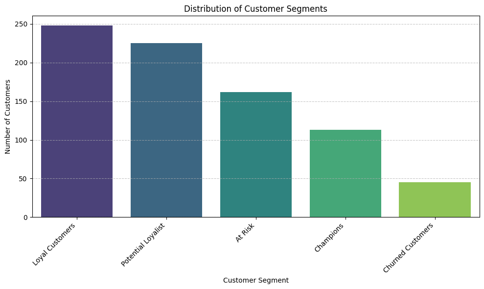
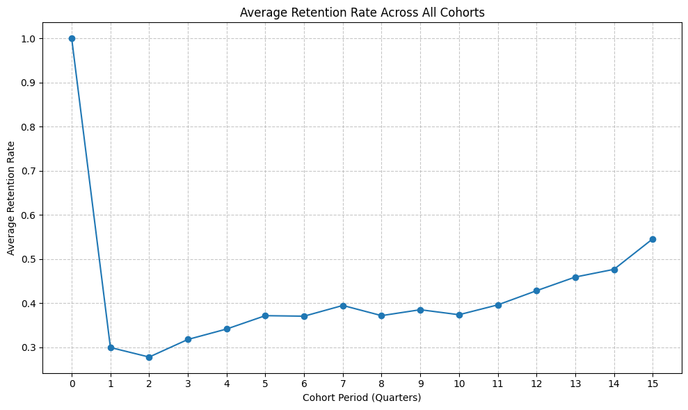

# 📊 Business Insights & Analytical Conclusions

> **Project:** Sales Analytics & Customer Behavior Dashboard  
> **Tool:** Tableau (Dashboard) + Python (Notebooks)  
> **Data Period:** 2021–2023 | **Dataset:** ~10K+ orders across US regions

---

## 1. Sales Performance — Key Findings

### Year-over-Year Growth (2023 vs 2022)
| Metric | CY 2023 | YoY Growth |
|---|---|---|
| Total Sales | $733K | ▲ 20.4% |
| Total Profit | $93K | ▲ 14.2% |
| Total Quantity | 12K units | ▲ 26.8% |

**Business Decision:** The strong revenue growth (+20.4%) paired with a slightly lower profit growth (+14.2%) signals that the business is scaling volume through discounting or lower-margin products. Management should investigate whether the discount strategy is sustainable or if it is eroding margins over time.

### Product Subcategory Performance
- **Phones and Chairs** are the top revenue-generating subcategories, confirming continued consumer and corporate demand for these product lines.
- **Tables and Machines** show negative profit margins (red bars in subcategory chart), indicating that these categories are loss-making — either due to aggressive discounting or unfavorable cost structures.
- **Copiers** generate the highest profit per sale despite moderate sales volume, making them the most efficient product line in terms of profitability.

**Business Decision:** The company should consider reducing or eliminating discounts on Tables and Machines, or re-evaluate supplier pricing for these categories. Copiers present a strong upsell opportunity to corporate clients.

### Weekly Trend Analysis
- Sales and profit are consistently above average in **weeks 10–20 (March–May)** and again in **weeks 40–52 (October–December)**.
- The mid-year trough (weeks 25–35, roughly July–August) represents a seasonal slowdown.

**Business Decision:** Marketing campaigns and promotions should be front-loaded before the mid-year dip. Inventory planning should align with the Q4 surge. The weekly reference line (Avg: $13K Sales, Avg: $1K Profit) provides an actionable threshold for performance monitoring.

---

## 2. Customer Behavior — Key Findings

### Customer Growth Metrics (2023 vs 2022)
| Metric | CY 2023 | YoY Growth |
|---|---|---|
| Total Customers | 3K | ▲ 28.0% |
| Total Orders | 1,687 | ▲ 28.0% |
| Avg Sale / Customer | $1,058 | ▲ 10.8% |

**Business Decision:** Customer acquisition is healthy — a 28% growth in both customers and orders shows that new customer volume is driving the overall business expansion. The 10.8% increase in average sale per customer suggests that customers are also spending more on each visit, pointing to successful upselling or increasing product basket sizes.

### Customer Distribution (Order Frequency)
| Segment | Customer Count |
|---|---|
| 1 Order | 374 |
| 2–3 Orders | 1,583 |
| 4–6 Orders | 1,026 |
| 7+ Orders | 6,236 |

The distribution is heavily skewed toward high-frequency buyers (7+ orders), which is a very positive sign of strong customer retention and loyalty.

**Business Decision:** The 374 one-time buyers represent a retention opportunity. A targeted re-engagement campaign (email winback, loyalty discount, personalized outreach) aimed at the 1-order and 2-3 order segments could meaningfully improve retention rates and lifetime value without significant acquisition cost.

### Top 10 Customers by Profit
- **Raymond Buch** leads with $7K profit from just 3 orders at $14K in sales — a 50% profit margin, extraordinarily high.
- **Hunter Lopez** and **Tom Ashbrook** each generated ~$5K in profit with only 2 orders — confirming that low order count does not equal low value.
- **Jane Waco** and **Jim Epp** placed 4–5 orders each, indicating frequent buyers who may be good candidates for a VIP/loyalty program.

**Business Decision:** The top 10 customers contribute disproportionately high profit. A proactive account management strategy — dedicated support, early product previews, personalized offers — should be established for these customers to protect and grow these relationships. Churn among this cohort would materially impact profitability.

---

## 3. RFM Analysis — Customer Segmentation

Using Recency, Frequency, and Monetary (RFM) scoring from the Python notebook (`RFM_analysis_sales_data.ipynb`):

- **Champions** (high R, high F, high M): Small group of repeat, high-value buyers. These are the customers in the Top 10 table. Reward and retain them.
- **Loyal Customers** (moderate-high F): The 7+ order cohort. These customers are habitual buyers — engagement programs and subscription-style offers work well here.
- **At-Risk Customers** (low R, formerly high F): Customers who used to buy often but have gone quiet. Winback campaigns with personalized discounts are appropriate.
- **Lost/Inactive** (very low R, low F): These customers have not ordered in a long time. Low-cost reactivation (e.g., a single re-engagement email) is worth attempting before writing them off.

**Business Decision:** The RFM segments provide a clear framework for marketing budget allocation. Rather than spending equally across all customers, marketing dollars should be concentrated on Champions (retention) and At-Risk (winback), which yield the highest ROI.

---

## 4. Time Series Analysis — Seasonality & Forecasting

From `time_series_analysis_sales_data.ipynb`:

- A clear **annual seasonality pattern** is confirmed: sales accelerate in Q4 (October–December) every year across the dataset.
- The long-term trend line shows **consistent year-over-year growth**, confirming that the business is not just seasonal but structurally growing.
- Month-over-month volatility is highest in profit (due to discounting events and order mix variation), while sales volume is more predictable.

**Business Decision:** Supply chain and staffing planning should treat Q4 as peak season and pre-position inventory and logistics capacity by September. The time series model can serve as an early warning system — weeks that fall below the trend line warrant immediate investigation into root causes (competitive activity, regional disruption, etc.).

---

## 5. Cohort Analysis — Retention Over Time

From `chort-analysis.ipynb`:

- Cohorts acquired in the earlier years of the dataset show **stronger long-term retention** compared to more recent cohorts, which is typical — older customers have had more time to establish purchasing habits.
- The Month 0 → Month 1 drop in retention (the most critical cohort transition) reveals that a significant portion of new customers do not return after their first purchase.

**Business Decision:** The biggest lever for improving overall retention is converting first-time buyers into second-time buyers. A dedicated post-purchase flow (follow-up email within 7 days, product recommendation, or small discount on next order) should be implemented specifically targeting the Month 0 → Month 1 window.

---

## 6. How the Dashboard Satisfies Business Requirements

The project was built against a formal requirements document. Here is how each requirement was addressed:

| Requirement | Implementation |
|---|---|
| KPI tracking with YoY comparison | Three KPI tiles per dashboard showing CY value, trend sparkline, and delta vs PY |
| Sales trend analysis | Monthly area/line charts with peak (blue dot) and trough (red dot) annotations |
| Product-level performance | Side-by-side bar chart: 2023 sales vs 2022 sales + profit/loss indicator per subcategory |
| Weekly granularity with benchmarks | Weekly bar charts with dashed average reference lines and above/below-average color coding |
| Customer segmentation | Histogram grouping customers by order frequency (1, 2–3, 4–6, 7+ orders) |
| High-value customer identification | Ranked Top 10 customers table with orders, sales, profit, and last order date |
| Dynamic year selection | Tableau parameter control to switch between historical years across both dashboards |
| Cascading product filters | Category → Sub-Category filter with dependent logic (Sub-Category resets on Category change) |
| Cascading location filters | Region → State → City filter hierarchy |
| Cross-dashboard navigation | Persistent icon-based nav bar (Sales Dashboard ↔ Customer Dashboard) |
| Accessibility | WCAG AA color contrast maintained; optimized for 1440px desktop viewport |
| Interactivity | Every chart element acts as a cross-filter for the rest of the dashboard |

---

## 7. Summary: The Business Story

The data tells a clear and optimistic story: **the business is in healthy growth mode**. Revenue is up 20%, customers are up 28%, and the average transaction value is rising. The customer base is loyal — the majority of buyers place 7+ orders — and the Top 10 customers generate outsized profit.

The risks are equally clear: **Tables and Machines are loss-making** and deserve pricing or cost scrutiny. **New customer retention after the first purchase** is the primary churn risk. And while **Q4 is reliably strong**, the mid-year trough is an untapped opportunity for targeted campaigns.

The dashboard operationalizes these insights for four distinct stakeholder groups — Sales Managers, Executives, Marketing Teams, and Senior Management — giving each audience the specific lens they need to act.

---

*Insights authored based on EDA, RFM, Time Series, and Cohort analysis notebooks alongside the Tableau dashboard visualizations.*
