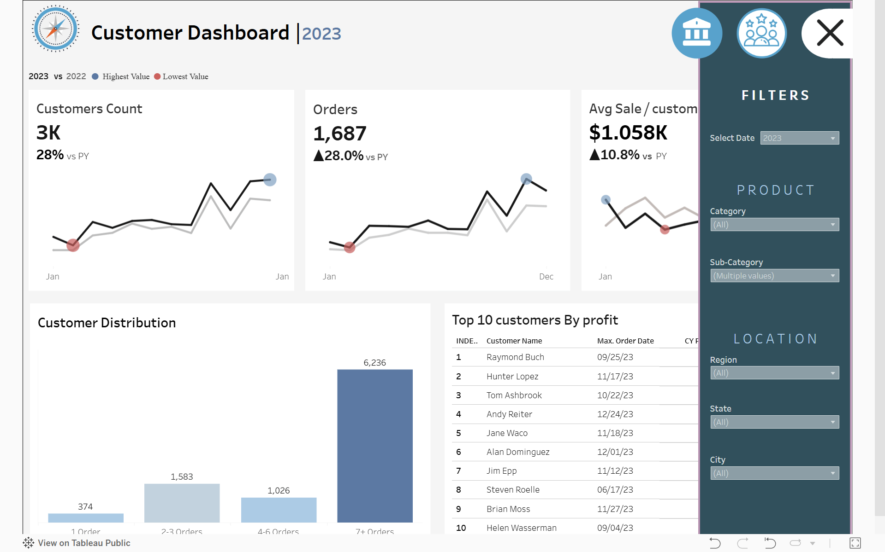

# Sales Analytics & Customer Behavior Dashboard

<div align="center">


**A production-grade Business Intelligence suite built in Tableau with supporting Python analytics.**  
Covers sales performance monitoring, customer behavior analysis, RFM segmentation, time series forecasting, and cohort retention.

[](https://public.tableau.com/shared/2ZKT8WGD2?:display_count=n&:origin=viz_share_link)

</div>

---

## 📸 Dashboard Preview

### Sales Performance Dashboard


### Customer Analytics Dashboard


### Filter Panel & Navigation


---

## 🎯 Project Objective

This project answers a real business question: *How do we give sales managers, executives, and marketing teams a single, reliable view of performance — without requiring them to know SQL or Python?*

The result is a two-dashboard Tableau suite backed by Python notebooks that handle exploratory analysis, customer segmentation (RFM), time series decomposition, and cohort retention — transforming four raw CSV files into actionable business intelligence.

---

## 📁 Repository Structure

```
Sales-Analytics-Customer-Behavior-Dashboard/
│
├── datasets/
│   ├── Orders.csv          # Transaction-level sales data
│   ├── Customers.csv       # Customer profiles
│   ├── Products.csv        # Product catalog with categories
│   └── Location.csv        # Geographic hierarchy (Region → State → City)
│
├── notebooks/
│   ├── EDA.ipynb                          # Exploratory Data Analysis
│   ├── RFM_analysis_sales_data.ipynb      # RFM customer segmentation
│   ├── time_series_analysis_sales_data.ipynb  # Seasonality & trend analysis
│   └── chort-analysis.ipynb               # Cohort retention analysis
│
├── screenshots/
│   ├── sales-dashboard.png
│   ├── customer-dashboard.png
│   ├── filter_and_navigation.png
│   ├── customer-segments-distribution.png
│   └── average-retention-rate.png
│
├── INSIGHTS.md              # Full business conclusions & decision rationale
├── Dashboard_Requirements.pdf
└── README.md
```

---

## 📊 Dashboards

### 1. Sales Performance Dashboard

Gives sales managers and executives a consolidated, year-over-year view of business health.

| Component | What It Shows |
|---|---|
| **KPI Tiles** | Total Sales ($733K ▲20.4%), Total Profit ($93K ▲14.2%), Total Quantity (12K ▲26.8%) vs prior year |
| **Monthly Trend Lines** | CY vs PY sparklines per KPI with peak and trough annotations |
| **Subcategory Analysis** | Side-by-side horizontal bars (CY vs PY sales) with profit/loss overlay — identifies loss-making categories (Tables, Machines) |
| **Weekly Trends** | Bar chart at weekly granularity with dashed average reference line; above-average weeks in blue, below in orange |

**Key finding:** Phones and Chairs lead revenue; Copiers lead profit efficiency; Tables and Machines are loss-making.

---

### 2. Customer Analytics Dashboard

Provides the marketing team with behavioral intelligence to drive retention, segmentation, and VIP strategies.

| Component | What It Shows |
|---|---|
| **KPI Tiles** | Total Customers (3K ▲28%), Total Orders (1,687 ▲28%), Avg Sale/Customer ($1,058 ▲10.8%) |
| **Customer Trends** | Monthly CY vs PY trend lines for all three customer KPIs |
| **Customer Distribution** | Histogram by order frequency: 1 order (374), 2–3 orders (1,583), 4–6 orders (1,026), 7+ orders (6,236) |
| **Top 10 by Profit** | Ranked table: Customer Name, Last Order Date, CY Profit, CY Sales, Order Count |

**Key finding:** 68% of customers place 7+ orders — strong loyalty base. Raymond Buch generates $7K profit at ~50% margin from 3 orders alone.

---

## ⚙️ Interactivity & UX Features

- **Year Parameter Control** — Switch between historical years; all KPIs and charts update dynamically.
- **Cross-Dashboard Navigation** — Icon-based persistent nav bar to move seamlessly between dashboards.
- **Chart-as-Filter** — Click any chart element to cross-filter the entire dashboard.
- **Cascading Product Filters** — Category → Sub-Category (Sub-Category resets when Category changes).
- **Cascading Location Filters** — Region → State → City hierarchical drill-down.
- **WCAG AA Accessibility** — Color contrast ratios maintained throughout; tooltips on all metrics.
- **Responsive Layout** — Optimized for 1440px desktop screens.

---

## 🐍 Python Notebooks

Four supporting notebooks extend the analysis beyond what Tableau can do natively:

### `EDA.ipynb` — Exploratory Data Analysis
- Data quality checks, null handling, and type validation across all four datasets
- Distribution analysis for Sales, Profit, Discount, and Quantity
- Category and region breakdowns as a foundation for dashboard design

### `RFM_analysis_sales_data.ipynb` — Customer Segmentation
- Computes Recency, Frequency, and Monetary scores per customer
- Assigns RFM segments: Champions, Loyal, At-Risk, Lost
- Enables targeted marketing decisions by customer value tier


### `time_series_analysis_sales_data.ipynb` — Trend & Seasonality
- Monthly and weekly aggregation of sales and profit
- Confirms strong Q4 seasonality (Oct–Dec) each year
- Identifies consistent mid-year demand trough (Jul–Aug)
- Long-term trend line confirms structural business growth

### `chort-analysis.ipynb` — Retention Cohorts
- Cohort matrix tracking customer retention from first purchase month
- Identifies the critical Month 0 → Month 1 drop as the key churn inflection point
- Older cohorts show stronger long-term retention patterns


---

## 🗄️ Datasets

All four datasets live in `datasets/` and are joined in Tableau via shared keys.

| File | Key Fields | Rows (approx.) |
|---|---|---|
| `Orders.csv` | Order ID, Customer ID, Product ID, Postal Code | ~10K |
| `Customers.csv` | Customer ID, Customer Name | ~800 |
| `Products.csv` | Product ID, Category, Sub-Category | ~1,900 |
| `Location.csv` | Postal Code, City, State, Region | ~600 |

Data schema uses semicolons as delimiters. Sales and Profit fields use European decimal notation (comma as decimal separator).

---

## 💡 Key Business Insights

See [`INSIGHTS.md`](INSIGHTS.md) for the complete analytical conclusions. A summary:

1. **Growth is real but margin growth lags** — Sales up 20.4%, profit only up 14.2%. Discount strategy warrants review.
2. **Tables and Machines are loss-making** — Two subcategories are actively destroying margin. Pricing or supplier renegotiation needed.
3. **Copiers are the profit efficiency champion** — High margin per unit, strong upsell opportunity to corporate segment.
4. **68% of customers are high-frequency buyers (7+ orders)** — Retention is strong; the focus should be on converting 374 one-time buyers into repeat customers.
5. **Top 10 customers are disproportionately valuable** — Raymond Buch alone delivers $7K profit. VIP account management is essential.
6. **Q4 is reliably the peak season** — Inventory, logistics, and marketing should all be pre-positioned by September each year.
7. **Month 0 → Month 1 is the critical retention window** — A post-purchase follow-up flow targeting first-time buyers can meaningfully improve LTV.

---

## 👥 Stakeholder Mapping

| Stakeholder | Dashboard / Feature Used | Decision Supported |
|---|---|---|
| Sales Managers | Sales Dashboard — Weekly trends | Identify underperforming weeks, course-correct in real time |
| Executives | Sales Dashboard — KPI tiles + YoY delta | Quarterly performance review, investor reporting |
| Marketing Teams | Customer Dashboard — Distribution, Top 10 | Segment targeting, loyalty programs, VIP outreach |
| Senior Management | Both dashboards — Cascading filters | Strategic territory and product portfolio decisions |

---

## 🛠️ Tools & Stack

| Layer | Tool |
|---|---|
| Visualization & BI | Tableau Desktop / Tableau Public |
| Data Analysis | Python 3, Jupyter Notebook (Google Colab) |
| Data Manipulation | Pandas |
| Statistical Analysis | Scipy, Matplotlib, Seaborn |
| Data Format | CSV (semicolon-delimited) |
| Version Control | Git / GitHub |

---

## 🚀 How to Explore

**To view the live dashboard:**  
👉 [Open on Tableau Public](https://public.tableau.com/shared/2ZKT8WGD2?:display_count=n&:origin=viz_share_link)

**To run the notebooks locally:**
```bash
git clone https://github.com/Himanshu0518/Sales-Analytics-Customer-Behavior-Dashboard.git
cd Sales-Analytics-Customer-Behavior-Dashboard
pip install pandas matplotlib seaborn scipy jupyter
jupyter notebook notebooks/
```

Or open any notebook directly in Google Colab using the badge at the top of each `.ipynb` file.

---

## 📄 License

This project is licensed under the terms in the [LICENSE](LICENSE) file.
