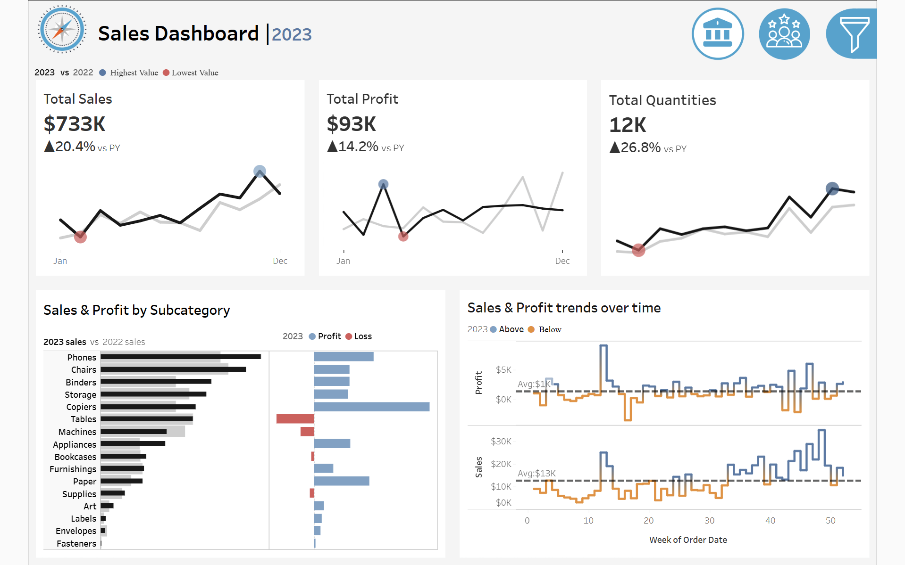
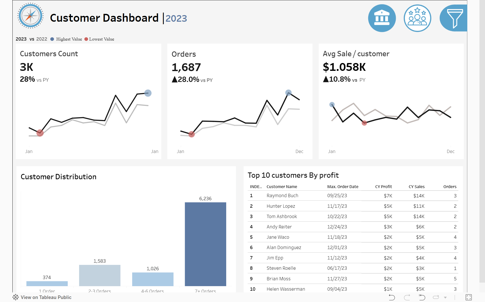

# Sales & Customer Analytics Dashboard

## 📊 Live Dashboard
You can view and interact with the live dashboard on Tableau Public:  
👉 **[View Dashboard on Tableau Public](https://public.tableau.com/shared/2ZKT8WGD2?:display_count=n&:origin=viz_share_link)**

## Project Overview
This project is a comprehensive **Tableau Reporting Suite** designed for Business Intelligence. It contains two interactive dashboards that support data-driven decision-making across sales and marketing teams. The suite provides deep insights into sales performance, customer behavioral trends, profitability, and order distributions.

## Dashboards Included

### 1. Sales Performance Dashboard
Presents a consolidated overview of core sales metrics and trends, enabling stakeholders to conduct year-over-year (YoY) analysis and identify patterns that drive strategic decisions.
- **KPI Overview**: Summary tiles for Total Sales, Total Profit, and Total Quantity showing Current Year (CY) and Previous Year (PY) values alongside delta indicators.
- **Sales Trends**: Monthly line/area charts for sales, profit, and quantity highlighting peak and trough months.
- **Product Subcategory Comparison**: Side-by-side bar charts showing sales performance per product sub-category with a profit overlay.
- **Weekly Trends for Sales and Profit**: Weekly granularity data with average reference lines and conditional formatting for above/below-average weeks.

### 2. Customer Analytics Dashboard
Provides a comprehensive view of customer data, trends, and behavioral patterns, enabling teams to understand customer segments, measure engagement, and improve satisfaction strategies.
- **KPI Overview**: Summary tiles for Total Customers, Sales per Customer, and Total Orders (CY vs PY).
- **Customer Trends**: Monthly time-series charts identifying peak and trough values for customer KPIs.
- **Customer Distribution**: Histogram grouping customers by order frequency (e.g., 1 order, 2-3 orders, 4-6 orders, 7+).
- **Top 10 Customers by Profit**: Ranked table of the ten most profitable customers showing orders, sales, profit, and last order date.

## Interactivity & Design Features
- **Year Selection**: Parameter control to dynamically filter the dashboards by historical year.
- **Cross-Dashboard Navigation**: Persistent navigation elements to seamlessly switch between Sales and Customer dashboards.
- **Interactive Filtering**: All charts act as interactive filters.
- **Global Data Filters**:
  - **Product Filters**: Category, Sub-Category (Cascading logic where Sub-Category narrows based on Category).
  - **Location Filters**: Region, State, City (Cascading logic where State narrows from Region, City narrows from State).
- **UX & Accessibility**: Adheres to WCAG AA color contrast minimums, optimized for 1440px desktop screens, and includes informative tooltips for all metric values.

## Datasets Used
The dashboards are powered by four main datasets located in the `datasets/` directory:
1. `Orders.csv`: Contains detailed transaction data for all orders.
2. `Customers.csv`: Contains customer profile information.
3. `Products.csv`: Contains product category and sub-category details.
4. `Location.csv`: Contains geographical data for sales regions.

## Stakeholders
- **Sales Managers**: Operational metrics and weekly trend monitoring.
- **Executives**: Year-over-year performance and profitability overview.
- **Marketing Teams**: Customer segmentation, engagement, and loyalty signals.
- **Management**: Strategic KPIs and top-customer intelligence.

## Tooling
- **Tableau Desktop / Tableau Server**